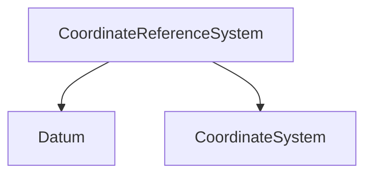
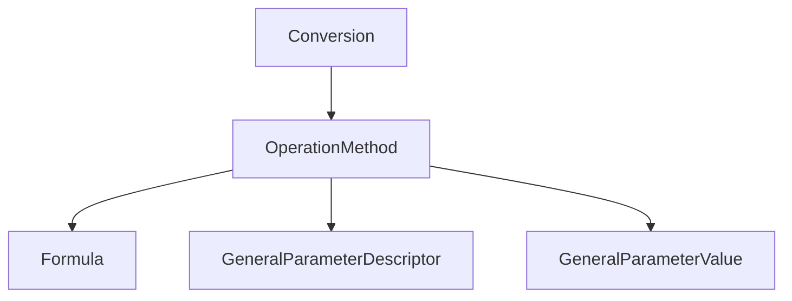
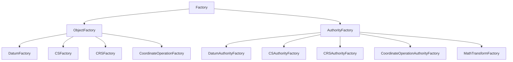
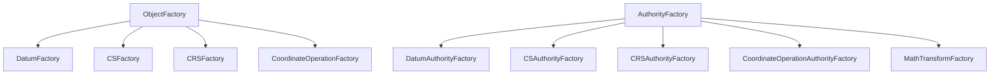

# 11.좌표 참조 및 파라미터 패키지

📌 **GeoAPI의 좌표 참조 및 파라미터 패키지 개요**  
✔ `org.opengis.referencing` 및 `org.opengis.parameter` 네임스페이스 사용  
✔ **ISO 19111:2007 (Spatial Referencing by Coordinates) 표준을 기반으로 구현**  
✔ **OGC 01-009 (Coordinate Transformation Services, 2003) 표준 포함**  

📌 **주요 기능**  
✔ **지리 공간 데이터를 참조하는 좌표 시스템 정의**  
✔ **객체 팩토리 및 수학적 변환 연산자 포함**  
✔ **참조 프레임 간 변환 연산 수행 가능**  

---

### **Table: Components of a Coordinate Reference System (CRS)**  

| **Component**             | **Description**                           |
| ------------------------- | ----------------------------------------- |
| CoordinateReferenceSystem | 상위 개념으로서, 지리 공간 데이터를 특정 좌표 체계로 참조하는 구조    |
| Datum                     | 참조 프레임을 정의하며, 좌표가 지구 표면에서 어떤 위치를 의미하는지 결정 |
| CoordinateSystem          | 좌표를 정의하는 규칙 및 차원을 나타내는 체계                 |

---

📌 **CRS 구성 요소 다이어그램**  



---

📌 **GeoAPI 좌표 참조 패키지의 활용 (Using the Referencing Package)**  
✔ **ISO 19111 표준을 기반으로 지리 공간 참조 개념 정의 가능**  
✔ **공학적(EPSG:5800) 및 측지적(EPSG:4326) 기준을 포함한 다양한 좌표 기준 정의 가능**  
✔ **다양한 좌표 시스템을 조합하여 CRS(좌표 참조 시스템) 정의 가능**  

---

### **Table: Components of a Mercator Projection**  

| **Component**              | **Description**                   |
| -------------------------- | --------------------------------- |
| Conversion                 | 변환 연산의 상위 개념으로, 좌표계를 변환하는 메커니즘 정의 |
| OperationMethod            | 좌표 변환을 수행하는 방법 및 알고리즘을 포함         |
| Formula                    | 변환 방식에 사용되는 수학적 공식 정의             |
| GeneralParameterDescriptor | 변환에 사용되는 일반적인 매개변수(Descriptor) 설정 |
| GeneralParameterValue      | 변환에 필요한 개별 매개변수 값(Value) 설정       |

---

📌 **머카토르 도법 구성 요소 다이어그램**  



---
📌 **GeoAPI 참조 패키지의 팩토리 개념 (Referencing Factories in GeoAPI)**  
✔ **OGC 01-009 표준에 정의된 팩토리 타입 포함**  
✔ **객체 생성을 표준화하는 ObjectFactory 및 AuthorityFactory 제공**  
✔ **EPSG SQL 데이터베이스와 같은 외부 참조 데이터 사용 가능**  

---

### **Table: Referencing Factories**  

| **Factory Type**                        | **Description**                                               |
|-----------------------------------------|---------------------------------------------------------------|
| Factory                                 | 모든 팩토리 객체의 상위 개념                                   |
| ObjectFactory                           | 인자로 전달된 타입을 조합하여 객체를 생성하는 팩토리             |
| DatumFactory                            | 측지 기준(Datum) 객체를 생성하는 팩토리                        |
| CSFactory                               | 좌표 시스템(Coordinate System) 객체를 생성하는 팩토리          |
| CRSFactory                              | 좌표 참조 시스템(CRS) 객체를 생성하는 팩토리                   |
| CoordinateOperationFactory              | 좌표 변환 연산을 위한 객체를 생성하는 팩토리                    |
| AuthorityFactory                        | 외부 데이터(예: EPSG)를 기반으로 객체를 생성하는 팩토리         |
| DatumAuthorityFactory                   | 기준(Datum) 객체를 외부 데이터 기반으로 생성하는 팩토리         |
| CSAuthorityFactory                      | 좌표 시스템 객체를 외부 데이터 기반으로 생성하는 팩토리         |
| CRSAuthorityFactory                     | 좌표 참조 시스템 객체를 외부 데이터 기반으로 생성하는 팩토리    |
| CoordinateOperationAuthorityFactory     | 좌표 변환 연산을 외부 데이터 기반으로 생성하는 팩토리           |
| MathTransformFactory                    | 수학적 변환 연산 객체를 생성하는 팩토리                         |

---

📌 **참조 팩토리 구조 다이어그램**  


---

📌 **팩토리 패턴을 활용한 객체 생성 예제**  
GeoAPI에서 정의된 참조 및 파라미터 패키지의 타입을 사용하려면  
먼저 특정 구현체에서 팩토리 객체를 참조한 후 팩토리 메서드를 통해 객체를 생성해야 합니다.  

✔ `ParameterValueGroup`을 먼저 생성  
✔ 이후 개별 `ParameterValue` 객체를 가져와 값을 설정  
✔ `MathTransformFactory`를 활용하여 변환 연산 수행 가능  

이러한 패턴을 사용하면 변환 연산의 모든 매개변수를 하나의 그룹으로 관리할 수 있습니다.  

---
📌 **11.1 패키지 매핑 (Package Mapping)**  
✔ **ISO 19111 패키지와 GeoAPI 패키지는 거의 일대일 대응됨**  
✔ **OGC 01-009 패키지는 GeoAPI의 팩토리 시스템과 연계되어 구조가 약간 다름**  
✔ **ISO 19115의 일부 타입도 GeoAPI 참조 패키지에 포함됨**  

---

### **Table: Referencing and Parameter Package Mapping**  

| **ISO 19111 (OGC 01-009) Package**       | **GeoAPI Package**                        |
|------------------------------------------|-------------------------------------------|
| IO Identified Object                     | `org.opengis.referencing`                 |
| RS Reference System                      | `org.opengis.referencing`                 |
| SC Coordinate Reference System           | `org.opengis.referencing.crs`             |
| CS Coordinate System                     | `org.opengis.referencing.cs`              |
| CD Datum                                 | `org.opengis.referencing.datum`           |
| CC Coordinate Operation                  | `org.opengis.referencing.operation`       |
|                                          | `org.opengis.parameter`                   |
| CS Coordinate Systems (OGC 01-009)       | `org.opengis.referencing`                 |
|                                          | `org.opengis.referencing.crs`             |
|                                          | `org.opengis.referencing.datum`           |
| CT Coordinate Transformations (OGC 01-009) | `org.opengis.referencing.operation`       |
| PT Positioning (OGC 01-009)              | `org.opengis.referencing.operation`       |

---

📌 **GeoAPI 참조 패키지 구조 요약**  
✔ **ISO 19111 패키지는 CRS, 좌표 시스템(CS), 기준(Datum), 변환(Operation)으로 나뉨**  
✔ **OGC 01-009의 변환(CT) 및 위치(Positioning) 패키지는 GeoAPI의 `operation` 패키지로 통합**  
✔ **팩토리 시스템을 통해 표준에 맞는 객체 생성 가능**  

---

📌 **11.2.2 좌표 변환 연산 생성 (Build a Coordinate Operation)**  
이 예제에서는 **고급 팩토리(CoordinateOperationFactory)를 사용하여 좌표 변환 연산을 생성**합니다.  

✔ `CoordinateOperationFactory`를 사용하여 변환 연산을 자동 생성  
✔ **소스 좌표 참조 시스템(CRS)과 타겟 CRS를 입력하면 변환 연산을 구성**  

```java
CoordinateOperationFactory opFactory = ...;

// 변환에 필요한 CRS 인스턴스 (이미 존재한다고 가정)
CoordinateReferenceSystem sourceCRS = baseGeographicCRS;
CoordinateReferenceSystem targetCRS = projectedCRS;

// 좌표 변환 연산 생성
CoordinateOperation op = opFactory.createOperation(sourceCRS, targetCRS);
```

📌 **특징**  
✔ `opFactory.createOperation(...)`을 호출하면 **필요한 변환 매개변수를 자동 설정**  
✔ **좌표 변환이 올바르게 설정됨을 보장하는 팩토리 패턴 활용**  

---

📌 **11.2.3 좌표 변환 수행 (Transform a Coordinate Between CRS)**  
이 예제에서는 **생성된 변환 연산을 사용하여 좌표를 변환**합니다.  

✔ `MathTransform`을 사용하여 좌표 변환 수행  
✔ **입력 좌표 배열을 변환 후 출력 좌표 배열에 저장**  
✔ **소스 및 타겟 배열의 크기는 CRS의 차원 수와 일치해야 함**  

```java
CoordinateOperation op = ...;

// 변환할 원본 좌표 (소스 CRS에서의 좌표)
double[] sourceOrdinates = ...;

// 변환된 좌표를 저장할 배열 (타겟 CRS에서의 좌표)
double[] targetOrdinates = new double[sourceOrdinates.length];

// 변환을 수행할 MathTransform 객체 가져오기
MathTransform mt = op.getMathTransform();

// 좌표 변환 수행
mt.transform(sourceOrdinates, 0, targetOrdinates, 0, 
    sourceOrdinates.length / mt.getSourceDimensions());
```

📌 **주의사항**  
✔ **소스 및 타겟 좌표 배열의 크기는 CRS 차원 수의 정수 배여야 함**  
✔ **MathTransform을 사용하여 좌표 변환을 수행**  

---
✅ **결론**  
✔ `CoordinateOperationFactory`를 사용하면 **복잡한 좌표 변환 연산을 쉽게 설정 가능**  
✔ `MathTransform`을 사용하여 **좌표 데이터를 변환하여 원하는 CRS로 변환 가능**  

---
📌 **11.3 표준과의 차이점 (Departure from Standards)**  
GeoAPI는 ISO 19111 표준과 몇 가지 주요 차이를 가집니다.  

✔ **MathTransform을 직접 포함**:  
   - ISO 19111에서는 좌표 변환 연산을 정의할 뿐이지만,  
   - GeoAPI는 실제 변환을 수행하는 `MathTransform` 객체를 포함합니다.  

✔ **팩토리 시스템 추가**:  
   - OGC 01-009 표준에서 정의된 팩토리 계층을 포함하여 객체 생성을 표준화  
   - `ObjectFactory`와 `AuthorityFactory` 두 가지 팩토리 계층을 제공  
   - EPSG 및 OGC의 CRS, AUTO 네임스페이스의 코드 기반 객체 생성 지원  

✔ **Ellipsoidal VerticalDatumType 추가**:  
   - ISO 19111은 타원체(Ellipsoid) 상의 고도 정보를 분리하지 않지만,  
   - GeoAPI는 `Ellipsoidal VerticalDatumType`을 추가하여 WKT(Well-Known Text) 형식과의 호환성을 유지  

📌 **팩토리 시스템 계층 구조**  



---

📌 **11.4 향후 작업 (Future Work)**  
GeoAPI의 참조(Referencing) 및 파라미터(Parameter) 패키지는 향후 크게 변경될 가능성이 낮습니다.  

✔ **ISO 19108 (시간 좌표 체계)과의 통합**  
   - ISO 19108 표준은 `TemporalCRS` 및 `TemporalCS`를 정의  
   - GeoAPI는 기존 참조 패키지에서 정의한 시간 관련 타입을 유지하며, ISO 19108과의 충돌을 방지할 계획  

📌 **정리**  
GeoAPI는 **ISO 19111 표준보다 확장된 기능을 제공하며, OGC 01-009 팩토리 시스템을 추가적으로 포함**하여  
객체 생성 및 좌표 변환 연산을 보다 편리하게 수행할 수 있도록 개선되었습니다.


