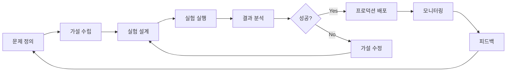

# MLOps 구현 패턴

## 📚 구현 방법론 및 패턴

### 검증 시스템 패턴
#### 데이터 검증 패턴
- **스키마 검증**: 입력 데이터 구조 및 타입 확인
- **분포 검증**: 데이터 분포 변화 감지 패턴
- **품질 게이트**: 품질 기준 미달 시 파이프라인 중단
- **이상 탐지**: 통계적/규칙 기반 이상값 감지

#### 모델 검증 패턴
- **출력 검증**: Shape와 값 범위 동시 검증
- **비즈니스 로직 검증**: 도메인 지식 기반 결과 검증
- **A/B 테스트**: 모델 간 성능 비교 검증
- **그라데이션 검증**: 입력 변화에 따른 출력 변화 검증

### 서비스 통합 패턴
#### 전처리/후처리 통합
```python
# 서비스 래퍼 패턴
class ModelService:
    def __init__(self, model_path, config):
        self.model = load_model(model_path)
        self.preprocessor = create_preprocessor(config)
        self.postprocessor = create_postprocessor(config)
        self.validator = create_validator(config)
    
    def predict(self, raw_input):
        # 입력 검증
        if not self.validator.validate_input(raw_input):
            raise ValueError("Invalid input")
        
        # 전처리
        processed = self.preprocessor.transform(raw_input)
        
        # 예측
        prediction = self.model.predict(processed)
        
        # 후처리
        result = self.postprocessor.transform(prediction)
        
        # 출력 검증
        if not self.validator.validate_output(result):
            raise ValueError("Invalid output")
            
        return result
```

#### 편향 탐지 및 보정 패턴
- **편향 메트릭**: Demographic parity, Equal opportunity
- **실시간 모니터링**: 편향 지표 실시간 추적
- **자동 보정**: 임계값 초과 시 자동 보정 적용
- **알림 시스템**: 편향 감지 시 즉시 알림

## 🏗️ MLOps 성숙도 모델

### Level 0: 수동 프로세스 (Manual Process)
#### 특징
- **주피터 노트북 중심**: 대화형 개발 환경
- **수동 배포**: 개발자가 직접 모델 배포
- **Ad-hoc 실험**: 체계적이지 않은 실험 관리
- **수동 모니터링**: 사람이 직접 성능 확인

#### 적용 시나리오
- 프로토타입 개발 단계
- 소규모 팀/프로젝트
- 일회성 분석 작업
- MLOps 도입 초기 단계

#### 한계점
- 재현성 부족
- 확장성 제한
- 에러 발생률 높음
- 운영 비용 증가

### Level 1: 파이프라인 자동화 (ML Pipeline Automation)
#### 구현 요소
- **데이터 파이프라인**: ETL 프로세스 자동화
- **학습 파이프라인**: 자동화된 모델 학습
- **평가 파이프라인**: 자동화된 모델 평가
- **배포 파이프라인**: CI/CD 기반 배포

#### 기술 스택
```yaml
# 예시 기술 스택
orchestration: Apache Airflow, Prefect
containerization: Docker
ci_cd: GitHub Actions, Jenkins
model_registry: MLflow
monitoring: Prometheus + Grafana
```

#### 개선 효과
- 반복 작업 자동화
- 일관된 실행 환경
- 기본적인 재현성 확보
- 개발 효율성 향상

### Level 2: 고도화된 MLOps (CI/CD for ML)
#### 구현 요소
- **Kubeflow 파이프라인**: Kubernetes 기반 ML 워크플로우
- **모델 레지스트리**: 중앙화된 모델 관리
- **자동 재학습**: 트리거 기반 자동 재학습
- **멀티모델 서빙**: 여러 모델 버전 동시 운영

#### 고급 기능
- **실험 추적**: 모든 실험의 체계적 기록
- **모델 거버넌스**: 모델 승인 및 배포 프로세스
- **A/B 테스팅**: 프로덕션 환경에서의 모델 비교
- **카나리 배포**: 점진적 모델 배포

#### 기술 스택
```yaml
# Level 2 기술 스택
platform: Kubernetes
ml_workflow: Kubeflow Pipelines
model_serving: KFServing, Seldon Core
experiment_tracking: MLflow, Weights & Biases
feature_store: Feast, Tecton
```

### Level 3: 완전 자동화 (Autonomous ML Systems)
#### 구현 요소
- **AutoML**: 자동화된 모델 선택 및 튜닝
- **지능형 모니터링**: AI 기반 이상 탐지
- **자율 대응**: 문제 발생 시 자동 해결
- **연속 학습**: 실시간 데이터로 지속적 학습

#### 고도화 특징
- **Meta-learning**: 과거 실험 학습을 통한 자동 최적화
- **Neural Architecture Search**: 자동 모델 아키텍처 탐색
- **Auto-scaling**: 트래픽에 따른 자동 리소스 조정
- **Self-healing**: 시스템 문제 자동 복구

## 🔧 협업 패턴

### 역할 기반 협업 모델
#### 소프트웨어 엔지니어
**핵심 역량**:
- 시스템 아키텍처 설계
- 인프라 구축 및 관리
- 성능 최적화
- 보안 및 컴플라이언스

**책임 영역**:
- MLOps 플랫폼 구축
- CI/CD 파이프라인 관리
- 모니터링 시스템 운영
- 스케일링 전략 수립

#### 리서치 사이언티스트 
**핵심 역량**:
- 도메인 지식 및 문제 정의
- 알고리즘 선택 및 개발
- 실험 설계 및 분석
- 모델 해석 및 개선

**책임 영역**:
- 모델 개발 및 실험
- 성능 분석 및 해석
- 알고리즘 연구 및 적용
- 비즈니스 인사이트 도출

#### ML/리서치 엔지니어
**핵심 역량**:
- 모델 엔지니어링
- 프로덕션 최적화
- 실험 인프라 구축
- 연구-개발 브릿지

**책임 영역**:
- 모델 최적화 및 배포
- 실험 플랫폼 관리
- 피처 엔지니어링
- 모델 성능 튜닝

### 협업 프로세스 패턴
#### 실험 주도 개발 (Experiment-Driven Development)


#### 모델 검증 게이트웨이
1. **연구 단계**: 리서치 사이언티스트 모델 개발
2. **엔지니어링 단계**: ML 엔지니어 최적화
3. **검증 단계**: 교차 검증 및 테스트
4. **승인 단계**: 이해관계자 리뷰
5. **배포 단계**: 프로덕션 환경 배포

## 📊 실험 관리 패턴

### 실험 추적 체계
#### 메타데이터 구조
```yaml
experiment:
  id: "exp_20250101_001"
  name: "CNN 아키텍처 비교"
  objective: "이미지 분류 성능 향상"
  hypothesis: "ResNet이 VGG보다 성능이 좋을 것"
  
parameters:
  model_type: "ResNet50"
  learning_rate: 0.001
  batch_size: 32
  epochs: 100
  
data:
  dataset_version: "v1.2.3"
  train_size: 10000
  val_size: 2000
  test_size: 2000
  
environment:
  python_version: "3.9"
  pytorch_version: "1.12.0"
  cuda_version: "11.6"
  
results:
  accuracy: 0.892
  precision: 0.885
  recall: 0.898
  f1_score: 0.891
```

#### 실험 비교 매트릭스
- **성능 지표**: 다양한 메트릭 동시 비교
- **통계적 유의성**: p-value, 신뢰구간
- **리소스 효율성**: 학습 시간, 메모리 사용량
- **복잡도**: 모델 크기, 추론 시간

### 재현성 보장 패턴
#### 환경 고정 전략
```dockerfile
# Dockerfile 예시
FROM python:3.9-slim

# 정확한 패키지 버전 고정
COPY requirements.txt .
RUN pip install -r requirements.txt

# 코드 복사
COPY src/ /app/src/
WORKDIR /app

# 실행 명령
CMD ["python", "src/train.py"]
```

#### 설정 관리 패턴
```python
# 설정 기반 실험 관리
@dataclass
class ExperimentConfig:
    model_type: str
    learning_rate: float
    batch_size: int
    random_seed: int = 42
    
    def to_dict(self):
        return asdict(self)
    
    @classmethod
    def from_yaml(cls, path):
        with open(path) as f:
            return cls(**yaml.safe_load(f))
```

## 🚀 배포 및 서빙 패턴

### 배포 전략
#### Blue-Green 배포
- **Blue 환경**: 현재 프로덕션 환경
- **Green 환경**: 새로운 모델 배포 환경
- **트래픽 전환**: 검증 후 즉시 전환
- **롤백**: 문제 발생 시 즉시 이전 환경으로 복구

#### 카나리 배포
- **점진적 배포**: 일부 트래픽부터 새 모델 적용
- **성능 모니터링**: 실시간 성능 지표 추적
- **자동 확장**: 성능 검증 후 점진적 트래픽 증가
- **자동 롤백**: 성능 저하 시 자동 이전 버전 복구

### 모니터링 패턴
#### 계층별 모니터링
- **인프라 레벨**: CPU, 메모리, 네트워크
- **애플리케이션 레벨**: 응답시간, 처리량, 에러율
- **모델 레벨**: 정확도, 데이터 드리프트, 편향
- **비즈니스 레벨**: KPI, ROI, 사용자 만족도

---

**카테고리**: MLOps 구현  
**난이도**: 중급-고급  
**최종 업데이트**: 2025년  
**관련 프로젝트**: [MLOps 구현 방법론](../../Projects/MLOpsBasics/1-2/머신러닝-프로젝트-구현-방법론.md)  
**관련 영역**: [실험 관리](../../Areas/MLOps/실험-관리.md) 